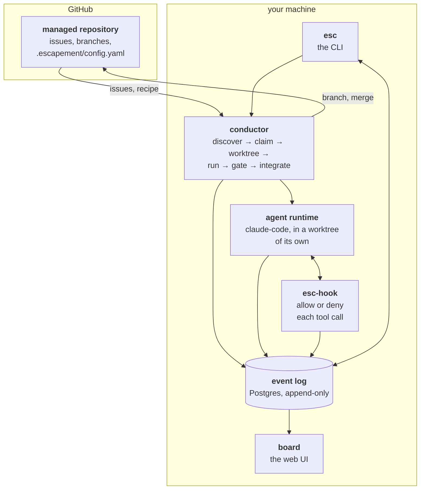

# Escapement

Event-sourced scheduler for autonomous code agents.

An escapement is the part of a clock that lets the mainspring out one tooth at a
time. Without it the spring releases all at once. That is the job: take a queue
of work, hand each item to an agent, hold it at a series of gates, and release
it only when every gate — including a human one — has passed.

It replaces `agent-loop.sh`, a bash harness that worked 73 tickets against one
repository over four days. That harness kept its state in GitHub labels, its
history in issue comments, and its telemetry in a log file nobody parsed, and
was driven by a timer. It could not answer *what state is this ticket in*, *why
did this not merge*, or *what is waiting on me*. Everything here follows from
making those three the same append-only log.

## Status

**Phases 0 and 1 are built.** The event log can be written, read, subscribed to,
reduced to state and projected; `esc run --once` takes one nominated issue from
discovery through claim, worktree, guard, agent, gates and the merge lane, and
the board shows the landed card with its receipt.

**Phase 1's exit criterion is not met.** It requires a real `nextloom-ai-admin`
issue merged into `develop`, and nothing has run against a real repository yet.
The App is configured and a read-only preflight against the real installation
passes; what remains is committing that repository's recipe and running one
ticket under supervision.

**Nothing here runs unattended, deliberately.** `esc run --once` merges as soon
as its gates pass, and the human gate that should sit in front of that merge is
Phase 2 ([#20], [#21]). Watch the runs until it exists.

See [`doc/roadmap.md`](doc/roadmap.md) for the phases and
[`doc/README.md`](doc/README.md) for what is settled and what is open.

## How it fits together

There are two sides, and almost everything confusing about the configuration
comes from not knowing which side a thing is on.

**Escapement runs on one machine of yours.** It owns a Postgres database, a
clone of each repository it manages, and the agent processes it starts.

**The repositories it manages live on GitHub and stay ordinary.** Nothing is
installed in them. There is no bot account, no webhook, no CI job, no label
state machine — one committed file, `.escapement/config.yaml`, and that is all.
If you deleted Escapement tomorrow the managed repository would not notice.



The log in the middle is the point. The conductor, the agent, the hook and the
gates all write to it, and the board and the CLI only read from it. Nothing has
private state, so *what state is this ticket in*, *why did this not merge* and
*what is waiting on me* are all the same query against the same table. The bash
harness this replaces kept those three answers in GitHub labels, issue comments
and an unparsed log file respectively, which is why it could answer none of them.

### The pieces

| | What it is | What it does not do |
|---|---|---|
| **conductor** | The scheduler. Finds work, claims it, cuts the worktree, starts the agent, runs the gates, merges. Everything it decides, it appends. | Never edits code itself. |
| **agent runtime** | The thing that actually writes the code — Claude Code today, in a worktree and an environment of its own. | Never talks to GitHub, and never sees a secret the recipe did not name. |
| **esc-hook** | A small binary Claude Code calls before every tool use. Exit 0 allows, exit 2 denies. Fails closed on anything it cannot understand. | Not a security boundary — see below. |
| **gates** | Named checks that produce a verdict about a *specific commit*. `process` gates run a command; `agent`, `policy` and `human` gates are Phase 2. | Not tied to a ticket, so a force-push invalidates a verdict by arithmetic. |
| **board** | Reads the log and shows one card per work item, with its cost, its guard trips and its gate verdicts. | Read-only today. Approve/reject is Phase 2 ([#21], [#22]). |
| **esc** | Configures projects and drives runs. `esc run --once` is supervised, one nominated issue. | Unattended running is Phase 2 ([#27]). |

The hook deserves the caveat it gets. It is a *coordination* mechanism, not a
sandbox: an agent that wants to get around it can. The three boundaries that
actually hold are the filtered environment, the isolated worktree and the
runtime sandbox — see [ADR 0007](doc/decisions/0007-dual-runtime.md).

### What you configure, and why each one exists

Four things, and they are on different sides of the line.

| | Where it lives | Why it exists |
|---|---|---|
| **A Postgres database of its own** | `.env.local` here, two connection strings | The log is the product, not a side effect. It must **not** be a managed project's database — Escapement has to keep running while that project is the thing being changed. |
| **A GitHub App** | `.env.local` here, App ID + private key | It reads issues and pushes branches as something that is not you. A fine-grained token can be wrong in a way nothing reports: one covered a repository's submodule but not the repository, and every run failed with a 403 that said nothing about scope. An installation makes reachability explicit and checkable — `esc add` verifies the four permissions before it writes anything. |
| **A recipe, per managed repository** | `.escapement/config.yaml`, committed **in that repository** | The repository's own team decides what an agent may pick up, what environment it gets, and what must pass before anything merges. It ships with the code and is reviewed like code. |
| **A policy, per project** | Escapement's log, set by `esc add --tier --require` | The part a managed repository **cannot** soften. Containment floor, mandatory gates, who may approve. |

The board and the CLI need no configuration of their own. They read the same log
the conductor writes, which is what makes them consistent by construction rather
than by discipline.

**Recipe and policy are the pair worth understanding before anything else.**

| | recipe | policy |
|---|---|---|
| Lives in | the managed repository | Escapement's event log |
| Changed by | that repository's team, through a pull request | whoever runs Escapement |
| Analogous to | a workflow file | branch protection |

A recipe may add strictness and can never remove any. Asking for a looser
containment tier than the policy's floor, or omitting a gate the policy marks
mandatory, is rejected **by name** rather than quietly downgraded. And the
recipe governing a run is read from `origin/<base>`, never from the agent's
branch — so an agent that edits it changes nothing about the run in flight. See
[ADR 0005](doc/decisions/0005-config-in-target-repo.md).

### What one run actually does

`esc run --once nextloom-ai-admin --issue 120`, end to end:

1. **Resolve the recipe** from `origin/develop` — the base recorded when the
   project was registered, not whatever GitHub currently calls the default
   branch. (Those differ more often than you would think; the repository this
   was first run against had a feature branch as its default.)
2. **Check the recipe against the policy.** A conflict stops here, named.
3. **Claim the issue** — an event, so two schedulers cannot take the same one.
4. **Cut a worktree** from Escapement's own mirror. Never your checkout.
5. **Plant a filtered environment file.** Only the variable names the recipe
   allowed exist in it. Everything else is *absent*, not redacted.
6. **Start the agent** with the hook wired in, at the tier policy and recipe
   agree on.
7. **Run the gates** in recipe order, stopping at the first refusal.
8. **Integrate** under a Postgres advisory lock: merge the base in, verify,
   merge out. Every exit path appends an event — including the failures.

Step 8 is shaped the way it is because of one expensive silence. The old
harness's integrate step had six `return 1` paths and not one of them emitted a
log line, a comment or a label; two tickets re-ran five times for roughly $29
while the actual cause — uncommitted work in the operator's own checkout — was
never reported by anything at all.

## Layout

| | |
|---|---|
| `packages/core` | Event catalogue, upcasters and aggregate reducers. Zero I/O, so it tests without a database. |
| `packages/env` | Where configuration values come from, for everything else. |
| `packages/store` | The Postgres event store: append, read, subscribe, and the projection runner. Prisma 8 for reads and writes, `pg` for `LISTEN/NOTIFY`. |
| `packages/config` | The recipe schema, the presets, and the policy rules a recipe is checked against. |
| `packages/github` | The App: JWT, installation tokens, and a **read-only** client. Writes go through git. |
| `packages/conductor` | Discovery, the queue, claiming, worktrees, the guard, the hook socket, and the merge lane. |
| `packages/gates` | The gate pipeline and the `process` gate. |
| `packages/runtime` | Containment tiers, and starting Claude Code. |
| `packages/hook` | `esc-hook` — the binary Claude Code calls before every tool use. |
| `apps/cli` | `esc` — `add`, `run`, `status`, `doctor`, `projection`. |
| `apps/board` | The web UI. Real cards, read from the projection. |
| `doc/` | The design, every decision, and the experiments that back them. |

[#20]: https://github.com/steven-zhc/escapement/issues/20
[#21]: https://github.com/steven-zhc/escapement/issues/21
[#22]: https://github.com/steven-zhc/escapement/issues/22
[#27]: https://github.com/steven-zhc/escapement/issues/27

## Getting started

```bash
pnpm install
cp .env.example .env.local        # then paste the connection string
pnpm contract:emit                # offline — no database needed
pnpm typecheck
```

`.env.local` lives at the repo root and is gitignored. A real environment
variable beats it, which is what makes CI and launchd work with no file at all.

**Two connection strings, one database.** `DATABASE_URL` is pooled, for ordinary
queries; `DIRECT_DATABASE_URL` is session mode, for migrations, `LISTEN/NOTIFY`
and advisory locks. A transaction pooler breaks all three, and breaks them
without erroring — see [ADR 0009](doc/decisions/0009-two-connections.md).

The event store must be **its own database**, not one belonging to a managed
project — Escapement has to keep running while a managed project is the thing
being changed.

**The tests need a third and fourth string, and refuse to run without them.**
`TEST_DATABASE_URL` and `TEST_DIRECT_DATABASE_URL` point at a *different*
database. The suite is not mocked — it appends real events, runs real
projections and takes real advisory locks — so pointed at your own log it
leaves work items and board cards behind. It did: twenty-four cards from ten
throwaway `esctest*` projects, and none from a real one. Cleaning that up is
not cheap either, because truncating a projection and replaying it brings the
cards straight back; the only way to remove them is to delete from an
append-only table.

Give the test database its schema with:

```bash
ESCAPEMENT_TEST=1 pnpm --filter @escapement/store db:bootstrap
```

### Bringing the database up

Prisma 8 splits planning from applying. Planning is offline; only the second
half needs a reachable database.

```bash
pnpm db:init                      # bootstrap the database and sign it
pnpm db:bootstrap                 # apply notify.sql, then prove it worked
```

`db:bootstrap` is not optional and is not Prisma's job. Prisma models tables, not
triggers, so `notify.sql` carries the two things the schema cannot express: the
`NOTIFY` trigger every subscriber wakes on, and the rules that make `events`
append-only in the database rather than by convention. The script then asserts
ten properties, including a **cross-connection** NOTIFY — the check that catches
a transaction pooler, which drops notifications silently.

An initial migration is already planned and committed; `db:plan --name <slug>` is
only needed after the contract changes.

### Checking it

```bash
pnpm esc doctor                   # non-zero exit on any failure
pnpm esc projection lag           # how far each projection is behind the log
```

`esc doctor` never writes to the event log — every check reads the catalogue,
and the one exception is a `NOTIFY`, which touches no table. It holds a listener
open, pauses long enough for a pool to churn, and notifies from a second
connection, because a check that merely opens the direct connection passes
against a transaction pooler and proves nothing
([experiment 003](doc/experiments/003-doctor-catches-a-pooler.md)).

Checks that depend on code Phase 1 has not written yet print as `skip`, naming
the issue that will fill them in.

## Connecting GitHub

Escapement talks to GitHub as a **GitHub App**, not as a personal access token.
The reason is a measured failure: on 2026-08-30 a fine-grained PAT covered the
admin repository's *submodule* but not the repository itself, and every CI run
failed with a 403 that said nothing about scope. An App's reach is explicit in
its installation, so `esc add` can ask and answer that question at onboarding
time instead of a day later. See
[ADR 0006](doc/decisions/0006-github-app.md).

This part cannot be automated: creating an App is a browser step, and the
private key it hands you is a real secret.

### 1. Create the App

Go to **Settings → Developer settings → GitHub Apps → New GitHub App**
(<https://github.com/settings/apps/new> for a personal account).

| Field | What to put |
|---|---|
| **GitHub App name** | Anything free — it is globally unique. `escapement-<your-handle>` works. |
| **Homepage URL** | Required by the form and otherwise unused. The repository URL is fine. |
| **Webhook → Active** | **Uncheck it.** Webhooks arrive with [#28](https://github.com/steven-zhc/escapement/issues/28); until then there is nothing listening and a failing delivery is noise. |
| **Where can this App be installed** | *Only on this account.* |

Then, under **Repository permissions**, set exactly these four:

| Permission | Level | What Escapement does with it |
|---|---|---|
| **Issues** | Read and write | reading work items, writing `agent:*` labels and comments |
| **Contents** | Read and write | cloning, pushing `agent/*`, merging into the base branch |
| **Pull requests** | Read and write | opening and reading pull requests |
| **Metadata** | Read-only | mandatory; GitHub selects it for you |

Leave every other permission at *No access*. `esc add` checks these four by name
and refuses to onboard a repository that is missing one, so a gap becomes a
message at onboarding rather than a 403 in the middle of a merge.

Click **Create GitHub App**.

### 2. Take the App ID and a private key

On the App's **General** page:

- **App ID** — a number near the top. This is `GITHUB_APP_ID`.
- **Private keys → Generate a private key** — this downloads a `.pem` file, and
  GitHub will not show it to you again.

Move the `.pem` somewhere **outside this repository**. It is the one credential
that is not short-lived, and `.gitignore` is not a place to rely on for it:

```bash
mv ~/Downloads/escapement-*.private-key.pem ~/.escapement-app.pem
chmod 600 ~/.escapement-app.pem
```

### 3. Install it on the repositories it should manage

**Install App** in the left sidebar → your account → **Only select
repositories** → pick each repository Escapement will manage.

An App that exists but is not installed on a repository is the exact failure
0006 is about, and `esc add` reports it as such:

```
the GitHub App is not installed on steven-zhc/nextloom-ai-admin. Install it on
that repository (Settings → GitHub Apps → Configure), then run esc add again.
```

### 4. Point Escapement at it

In `.env.local` at the repository root:

```bash
GITHUB_APP_ID=123456
GITHUB_APP_PRIVATE_KEY_PATH=~/.escapement-app.pem
```

`~` is expanded, and a relative path is relative to *this repository's root* —
not to whichever directory you ran the command from. Where only a single-line
value can be carried, `GITHUB_APP_PRIVATE_KEY` takes the PEM itself with `\n`
escapes instead.

No installation id is needed. It is looked up per repository, which is what
turns "the App is not installed there" into a sentence rather than a 404.

Check it:

```bash
pnpm esc doctor
```

```
  ok   github: app credentials
       app 123456, key from ~/.escapement-app.pem · requires issues:write,
       contents:write, pull_requests:write, metadata:read (verified per
       repository by esc add)
```

That check parses the key to prove it is a key rather than a path typo or a
truncated paste. It does **not** contact GitHub — whether an installation
actually grants those four permissions is a per-repository question, and
`esc add` is what asks it.

## Onboarding a repository

### 1. Give the repository a recipe

Escapement reads `<repo>/.escapement/config.yaml` **from the base branch**,
never from the branch an agent is working on. An agent that edits this file
changes nothing about the run in flight; the edit shows up in the diff and takes
effect from the next work item. That rule is borrowed from GitHub Actions and is
[ADR 0005](doc/decisions/0005-config-in-target-repo.md).

Commit this to the base branch of the repository being managed — not to
Escapement:

```yaml
version: 1

repo:
  base: develop
  # `git worktree add` does not populate submodules, and a worktree without them
  # fails every test that imports one — which reads on the board as though the
  # agent broke them.
  submodules: true

source:
  # Also the priority order: earlier wins.
  kinds: [bug, tech-debt]
  # Labels of yours that keep the agent off a ticket.
  exclude: [blocked, needs-design]

env:
  # Variable NAMES only, never values. Values resolve at runtime from the
  # conductor's environment, which the agent cannot see — so this file is safe
  # to commit.
  allow:
    - DATABASE_URL
    - CLERK_SECRET_KEY
  # Rarely the repository root: Next, Prisma and vitest read it from the app
  # directory.
  plantAt: apps/web/.env.local

gates:
  - kind: process
    name: build
    run: pnpm verify
    timeout: 15m

runtime:
  agent: claude-code
  limits:
    turns: 300
    wall: 2h
```

A shorter form, if the project is an ordinary pnpm workspace:

```yaml
version: 1
extends: pnpm-workspace
repo:
  base: develop
source:
  kinds: [bug]
env:
  allow: [DATABASE_URL]
  plantAt: apps/web/.env.local
```

`extends` fills in the submodule default, a `pnpm verify` build gate and the
runtime. It resolves to the same run as spelling all of it out, and hashes the
same — a preset's *name* is not part of what a run does, so it is not part of
the hash.

Only `process` gates run today. A recipe naming an `agent`, `policy` or `human`
gate is **refused**, naming the issue that implements it
([#18](https://github.com/steven-zhc/escapement/issues/18),
[#19](https://github.com/steven-zhc/escapement/issues/19),
[#20](https://github.com/steven-zhc/escapement/issues/20)) — a pipeline that
silently skipped a human approval would put a green board on a change nobody
approved.

### 2. Register it

```bash
pnpm esc add steven-zhc/nextloom-ai-admin
```

It checks the installation and its permissions **before** it writes anything, so
a half-onboarded project is not a state that exists. Then it reads the recipe
from the base branch, hashes it, and records `ProjectConfigured` and
`ProjectPolicySet`.

Policy is Escapement's, not the repository's — the tier floor and which gates are
mandatory live in Escapement's own log, where the agent cannot reach them:

```bash
pnpm esc add steven-zhc/nextloom-ai-admin --tier guarded --require build
```

A recipe may **add** strictness and can never remove it. One that drops a
mandatory gate, or asks for a tier below the floor, is rejected by name:

```
gates: recipe says build, policy requires a gate named "review"
       — the policy marks it mandatory, and a recipe cannot remove one
```

### 3. Run one ticket

```bash
pnpm --filter @escapement/hook build     # the guard binary is not committed
pnpm esc status nextloom-ai-admin        # what is runnable, and what is holding the rest
pnpm esc run --once nextloom-ai-admin --issue 117
```

**Nominate a ticket carrying no `agent:*` label.** `agent-loop.sh` is still
working the same repository on an hourly cycle until Phase 2, and that namespace
is where it keeps its state — discovery refuses anything in it precisely so the
two systems cannot both claim one ticket.

### When something refuses

Every refusal names itself. The common ones:

| What you see | What it means |
|---|---|
| `the GitHub App is not installed on …` | Step 3 above — install it on that repository. |
| `the installation is missing permissions:` | Step 1's table; each gap is listed with what it has, what it needs and what it is for. |
| `no .escapement/config.yaml on develop` | The recipe is missing from the **base branch**. A copy on the agent's branch is not read, by design. |
| `no esc-hook binary at …` | `pnpm --filter @escapement/hook build`. A run without the guard must not start. |
| `ENOENT … escapement-app.pem` | The key path is wrong. `~` and relative paths both work; relative is from this repository's root. |
| `stopped at recipe: … policy requires …` | The recipe would weaken the run. Every conflicting clause is listed at once. |
| `stopped at discover: owned-by-another-agent` | That issue carries an `agent:*` label. Pick one the old loop has not touched. |
